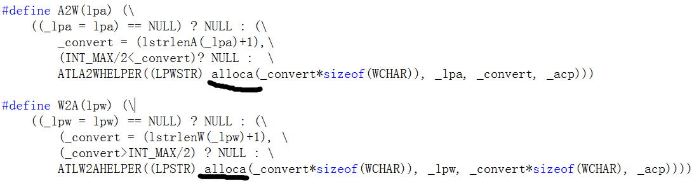

### 1 Linux GDB 调试准备工作

make clean; make

section1

```
gdb section1
```

有-g

```
Reading symbols from /root/gdbdebug/section1/section1...done.
```

无-g

```
Reading symbols from /root/gdbdebug/section1/section1...(no debugging symbols found)...done.
```


一次默认显示10行

```
list
l
```

断点

```
break
b
```

```
b main
b section1.cpp:8
```

查看断点

```
i b
```

Type

breakpoint

执行

```
run
r
```

单步执行

```
next
n
```

查看

```
print
p
```

显示所有局部变量

```
i locals
```

继续执行

```
continue
c
```


```
Missing separate debuginfos, use: debuginfo-install glibc-2.17-325.el7_9.x86_64
```

https://access.redhat.com/solutions/9907

https://bbs.csdn.net/topics/391965680


### 2 Linux GDB基本命令：启动调试与程序执行

启动调试并传入参数
gdb --args <exe>
set args <args>
r <args>


附加到进程
适用于程序已经启动了
gdb attach <pid>
gdb --pid <pid>


```
b order_bus
c

bt
f 3
```

```
detach
q
```


逐过程执行
单步执行(step-over)，遇到函数跳过函数
next
n


逐语句执行
单步执行（step-into),遇到函数进入函数
step
s


退出当前函数

finish


退出调试
detach（分离）
quit（退出）
q

如果程序是以gdb启动的，detach后程序还在正常运行。

### 3 Linux GDB基本命令：断点管理

设置断点

break/b 文件名:行号
在源代码某一行设置断点

```
b main.cpp:38
b main.cpp:46
```

b 函数名
为函数设置断点，同名函数会怎么样？

```
b testfun
```

rb 正则表达式
为满足正则表达式的函数设置断点

```
l -10
l main.cpp:10
l student.cpp:1
rb work
```

b 断点 条件
设置条件断点

```
b main.cpp:14 if i==90
r
p i
```

tb 断点
设置临时断点

```
b main.cpp:14
delete
tb main.cpp:14
```

查看/禁用/删除断点

i b
查看所有断点

disable/enable 断点编号
禁用，启用断点

delete 断点
删除断点

### 4 Linux GDB基本命令：查看/修改变量

查看变量

info args
查看函数参数

print 变量名
p 变量名
查看变量的值

set print null-stop
设置字符串的显示规则

set print pretty
显示结构体

set print array on
显示数组

使用gdb内嵌函数
比如sizeof，strlen,strcmp等

```
p sizeof(int)
```


修改变量的值

print 变量名=值
包括普通变量，结构体，类等

```
p test.age = 25
p strcpy(test.name, "Soft")
```

### 5 Linux GDB基本命令：查看/修改内存

查看/修改内存

examine

x  /选项 内存地址
x /s str
x /d
x /4d
x /16s 结构体变量地址

```
(gdb) p &itest
$5 = (int *) 0x7fffffffe1d4
(gdb) x (int *) 0x7fffffffe1d4
0x7fffffffe1d4:	0x12345678
(gdb) x &itest
0x7fffffffe1d4:	0x12345678
(gdb) x /4b &itest
0x7fffffffe1d4:	0x78	0x56	0x34	0x12
(gdb) x test_str
0x4009d5:	0x74
(gdb) x /s test_str
0x4009d5:	"this is a test"
(gdb) x /16d test_str
0x4009d5:	116	104	105	115	32	105	115	32
0x4009dd:	97	32	116	101	115	116	0	32

(gdb) p test
$7 = {name = "SimpleSoft\000", gender = 109 'm', age = 25}
(gdb) x &test
0x7fffffffe1c0:	83
(gdb) p sizeof(test)
$8 = 20
(gdb) x /20b &test
0x7fffffffe1c0:	83	105	109	112	108	101	83	111
0x7fffffffe1c8:	102	116	0	0	109	0	0	0
0x7fffffffe1d0:	25	0	0	0

(gdb) set (int)&test.gender = 110
Left operand of assignment is not an lvalue.
(gdb) set *(int*)&test.gender = 110
```

https://blog.csdn.net/zhanghaiyang9999/article/details/110957728
关于结构体大小解读

### 6 Linux GDB命令：查看/修改寄存器

```
(gdb) !cat main.cpp
(gdb) info registers
rax            0x400700	4196096
rbx            0x0	0
rcx            0x100	256
rdx            0x6d	109
rsi            0x19	25
rdi            0x400805	4196357
rbp            0x7fffffffe1e0	0x7fffffffe1e0
rsp            0x7fffffffe1e0	0x7fffffffe1e0
r8             0x7ffff74e2e80	140737342484096
r9             0x0	0
r10            0x7fffffffd5a0	140737488344480
r11            0x7ffff7153f30	140737338752816
r12            0x4005e0	4195808
r13            0x7fffffffe2e0	140737488347872
r14            0x0	0
r15            0x0	0
rip            0x4006b6	0x4006b6 <test_fun(char const*, int, int)+4>
eflags         0x206	[ PF IF ]
cs             0x33	51
ss             0x2b	43
ds             0x0	0
es             0x0	0
fs             0x0	0
gs             0x0	0
(gdb) i all-registers
```

查看寄存器
i registers
i r rdi
...

```
(gdb) i r rdx
rdx            0x6d	109
(gdb) i r rsi
rsi            0x19	25
(gdb) i r rdi
rdi            0x400805	4196357
(gdb) x /s 0x400805
0x400805:	"SimpleSoft"
(gdb) p (char*)0x400805
$1 = 0x400805 "SimpleSoft"
```


| **寄存器** | **函数参数**   |
| ---------- | -------------- |
| **rdi**    | **第一个参数** |
| **rsi**    | **第二个参数** |
| **rdx**    | **第三个参数** |
| **rcx**    | **第四个参数** |
| **r8**     | **第五个参数** |
| **r9**     | **第六个参数** |


修改寄存器

pc/rip (program counter)寄存器,保存程序下一条要执行的指令，通过修改pc寄存器来改变程序执行的流程

set var $pc=xxx
p $rip=xxx


显示汇编地址

```
info line 16
i r rip
p $rip=...
n
```

disassemble

### 7 Linux GDB命令：源代码查看/管理

源代码管理命令

显示源代码： list or l，默认显示10行
设置每次显示的行数：set listsize xx
查看指定函数代码：list test_fun
查看指定文件指定行代码：list main.cpp:15

```
l -
l test_c::test_member
l test_member
l test.cpp:test_member
```

### 8 Linux GDB调试 搜索源代码 设置源代码搜索目录

搜索源代码
search 正则表达式
forward-search 正则表达式
reverse-search 正则表达式

search后如果没有关键字，会自动使用上次的关键字


```
(gdb) show directories
Source directories searched: $cdir:$cwd
```

设置源代码搜索目录
directory path

### 9 Linux GDB调试 函数调用栈管理

两个概念

栈帧
调用栈

调用栈管理

backtrace/bt 查看栈回溯信息

frame n 切换栈帧

```
frame 2
i args
i locals
```

info f n 查看栈帧信息

```
(gdb) info f 0
Stack frame at 0x7fffffffdfa0:
```

### 10 Linux GDB调试 观察点

观察点
观察点是一个特殊的断点，当表达式的值发生变化时，它将中断下来。表达式可以是一个变量的值，也可以包含由运算符组合的一个或多个变量的值，例如' a + b '。有时被称为数据断点（VC里面就称之为数据断点）。

watch 写观察点

```
watch gdata
```

rwatch 读观察点
awtach 读写断点
info watch 查看观察点
delete/disable/enable 删除/禁用/启用观察点

```
b 22
r
i threads
watch gdata thread 3
```

```
watch gdata+gdata2 > 10
```

### 11 Linux GDB调试 捕获点

捕获点
捕获点是一个特殊的断点，命令语法为：
catch event
即捕获到event这个事件的时候，程序就会中断下来

catch assert -- Catch failed Ada assertions, when raised.
**catch catch** -- Catch an exception, when caught.
catch exception -- Catch Ada exceptions, when raised.
catch exec -- Catch calls to exec.
catch fork -- Catch calls to fork.
catch handlers -- Catch Ada exceptions, when handled.
catch load -- Catch loads of shared libraries.
catch rethrow -- Catch an exception, when rethrown.
catch signal -- Catch signals by their names and/or numbers.
**catch syscall** -- Catch system calls by their names, groups and/or numbers.
**catch throw** -- Catch an exception, when thrown.
catch unload -- Catch unloads of shared libraries.
catch vfork -- Catch calls to vfork.

```
catch throw
r
bt
f 1
i args
```

```
catch catch
r
bt
f 1
n
```

```
(gdb) catch syscall close
Catchpoint 1 (syscall 'close' [3])
(gdb) catch syscall 3
Catchpoint 2 (syscall 'close' [3])
(gdb) del
```

### 12 Linux GDB调试 断点相关

为断点执行命令
commands
cmd
end

```
(gdb) b 31
Breakpoint 1 at 0x4007f4: file main.cpp, line 31.
(gdb) commands
Type commands for breakpoint(s) 1, one per line.
End with a line saying just "end".
>p *curr
>p prev
>end
(gdb) i b
Num     Type           Disp Enb Address            What
1       breakpoint     keep y   0x00000000004007f4 in sort_list(_TEST_S_*) at main.cpp:31
        p *curr
        p prev
```

```
(gdb) b 24
Breakpoint 2 at 0x4007b5: file main.cpp, line 24.
(gdb) i b
Num     Type           Disp Enb Address            What
1       breakpoint     keep y   0x00000000004007f4 in sort_list(_TEST_S_*) at main.cpp:31
	breakpoint already hit 1 time
        p *curr
        p prev
2       breakpoint     keep y   0x00000000004007b5 in switch_node(_TEST_S_*, _TEST_S_*, _TEST_S_*) at main.cpp:24
(gdb) commands 2
Type commands for breakpoint(s) 2, one per line.
End with a line saying just "end".
>p node1->data
>p node2->data
>printf "prev node data is %d\n", prev_node->data
>end
(gdb) i b
Num     Type           Disp Enb Address            What
1       breakpoint     keep y   0x00000000004007f4 in sort_list(_TEST_S_*) at main.cpp:31
	breakpoint already hit 1 time
        p *curr
        p prev
2       breakpoint     keep y   0x00000000004007b5 in switch_node(_TEST_S_*, _TEST_S_*, _TEST_S_*) at main.cpp:24
        p node1->data
        p node2->data
        printf "prev node data is %d\n", prev_node->data
(gdb) c
Continuing.

Breakpoint 2, switch_node (prev_node=0x613c20, node1=0x613c40, node2=0x613c60)
    at main.cpp:24
24		node1->next = node2->next;
$4 = 1804289383
$5 = 846930886
prev node data is 0
(gdb) 
Continuing.

Breakpoint 2, switch_node (prev_node=0x613c60, node1=0x613c40, node2=0x613c80)
    at main.cpp:24
24		node1->next = node2->next;
$6 = 1804289383
$7 = 1681692777
prev node data is 846930886
```

```
(gdb) commands 2
Type commands for breakpoint(s) 2, one per line.
End with a line saying just "end".
>end
(gdb) i b
Num     Type           Disp Enb Address            What
1       breakpoint     keep y   0x00000000004007f4 in sort_list(_TEST_S_*) at main.cpp:31
	breakpoint already hit 1 time
        p *curr
        p prev
2       breakpoint     keep y   0x00000000004007b5 in switch_node(_TEST_S_*, _TEST_S_*, _TEST_S_*) at main.cpp:24
	breakpoint already hit 2 times
```

保存断点信息到文件
save breakpoints filename

```
(gdb) save breakpoints d.txt
Saved to file 'd.txt'.
(gdb) !cat d.txt
break /root/gdbdebug/breaks-section/main.cpp:31
  commands
    p *curr
    p prev
  end
break /root/gdbdebug/breaks-section/main.cpp:24
(gdb) commands 2
Type commands for breakpoint(s) 2, one per line.
End with a line saying just "end".
>i args
>end
(gdb) save breakpoints d.txt
Saved to file 'd.txt'.
(gdb) !cat d.txt
break /root/gdbdebug/breaks-section/main.cpp:31
  commands
    p *curr
    p prev
  end
break /root/gdbdebug/breaks-section/main.cpp:24
  commands
    i args
  end
```

从文件中读取断点信息
source filename

```
source d.txt
```

### 13 Linux gdb 文本用户界面

Text User Interface (TUI)

| **命令**               | **作用**               |
| ---------------------- | ---------------------- |
| layout  src            | 显示源码窗口           |
| layour  asm            | 显示汇编窗口           |
| layout  reg            | 显示寄存器窗口         |
| layout  split          | 切分窗口               |
| focus  src/asm/reg/cmd | 切换窗口交点           |
| info  win              | 查看当前拥有交点的窗口 |
| ctrl+x+a               | 退出窗口模式           |

```
focus src
fs src
```

```
help tui
```

### 14 Linux GDB调试 查看变量类型信息

比如查看结构体，类，派生类等

whatis

```
(gdb) whatis test1
type = test_1
(gdb) whatis node
type = NODE
(gdb) whatis main
type = int (int, char **)
(gdb) whatis test3.test_fun2
type = void (test_2 * const)
```

ptype /r /o /m /t

```
(gdb) ptype test1
type = class test_1 {
  private:
    int x;
    int *test;
    int y;

  public:
    test_1(void);
    ~test_1();
    virtual void test_fun(void);
}
(gdb) ptype /m test1
type = class test_1 {
  private:
    int x;
    int *test;
    int y;
}
```

set print object on

```
(gdb) ptype test2
type = class test_1 {
  private:
    int x;
    int *test;
    int y;

  public:
    test_1(void);
    ~test_1();
    virtual void test_fun(void);
} *
(gdb) set print object on
(gdb) ptype test2
type = /* real type = test_2 * */
class test_1 {
  private:
    int x;
    int *test;
    int y;

  public:
    test_1(void);
    ~test_1();
    virtual void test_fun(void);
} *
```

```
(gdb) ptype test3
type = /* real type = test_2 */
class test_2 : public test_1 {
  private:
    UL member1;

  public:
    test_2(void);
    ~test_2();
    virtual void test_fun2(void);
    virtual void test_fun(void);

    typedef unsigned long UL;
}
(gdb) ptype /t test3
type = /* real type = test_2 */
class test_2 : public test_1 {
  private:
    UL member1;

  public:
    test_2(void);
    ~test_2();
    virtual void test_fun2(void);
    virtual void test_fun(void);
}
```

```
(gdb) ptype node
type = struct NODE {
    int ID;
    int age;
    char gender;
    NODE *next;
    int test;
    char c;
}
(gdb) ptype node2
type = struct NODE2 {
    int ID;
    int age;
    NODE *next;
    int test;
    char gender;
    char c;
}
(gdb) ptype /o node
/* offset    |  size */  type = struct NODE {
/*    0      |     4 */    int ID;
/*    4      |     4 */    int age;
/*    8      |     1 */    char gender;
/* XXX  7-byte hole */
/*   16      |     8 */    NODE *next;
/*   24      |     4 */    int test;
/*   28      |     1 */    char c;
/* XXX  3-byte padding */

                           /* total size (bytes):   32 */
                         }
(gdb) ptype /o node2
/* offset    |  size */  type = struct NODE2 {
/*    0      |     4 */    int ID;
/*    4      |     4 */    int age;
/*    8      |     8 */    NODE *next;
/*   16      |     4 */    int test;
/*   20      |     1 */    char gender;
/*   21      |     1 */    char c;
/* XXX  2-byte padding */

                           /* total size (bytes):   24 */
                         }
(gdb) ptype /o test2
type = /* real type = test_2 * */
class test_1 {
                         private:
/*    8      |     4 */    int x;
/* XXX  4-byte hole */
/*   16      |     8 */    int *test;
/*   24      |     4 */    int y;
/* XXX  4-byte padding */

                           /* total size (bytes):   32 */
                         } *

```

i variables

只支持全局变量、静态变量

```
(gdb) i variables count
```

### 15 Linux GDB调试 多线程基本知识

基本概念
进程：通常被定义为一个正在运行的程序中的实例。程序在被实例化之前，只是一个二进制集合，没有实际意义。
线程：是系统调度的单元。

创建多线程程序
第一种方式：
使用 pthread
	Linux系统下的多线程遵循POSIX线程接口，称为pthread
#include <pthread.h>
pthread_create
pthread_join

创建多线程程序

### 16 Linux GDB调试 多线程基本知识-II

创建多线程程序

第二种方式：

支持全局函数
类的静态成员函数
类的普通成员函数        

使用C++的类来使用线程
#include <thread>
int data=10;
thread t1(&test_thread,(void*)&data);
thread t2(&test::do_work_1);
test test3;
thread t3(&test::do_work_2,test3);

### 17 Linux GDB调试 线程管理

线程管理相关命令：

info threads:查看所有线程信息

```
(gdb) in threads
Ambiguous command "in threads": inf, inferior, info, init-if-undefined, inspect, internals, interpreter-exec, interrupt.
(gdb) info threads
  Id   Target Id                                     Frame 
* 1    Thread 0x7ffff7feb740 (LWP 5794) "multhread2" main (argc=1, argv=0x7fffffffe0f8)
    at main.cpp:51
  2    Thread 0x7ffff6efd700 (LWP 5798) "multhread2" 0x00007ffff7bcde9d in nanosleep ()
   from /lib64/libpthread.so.0
  3    Thread 0x7ffff66fc700 (LWP 5799) "multhread2" 0x00007ffff7bcde9d in nanosleep ()
   from /lib64/libpthread.so.0
  4    Thread 0x7ffff5efb700 (LWP 5800) "multhread2" 0x00007ffff7bcde9d in nanosleep ()
   from /lib64/libpthread.so.0
  5    Thread 0x7ffff56fa700 (LWP 5801) "multhread2" 0x00007ffff7bcde9d in nanosleep ()
   from /lib64/libpthread.so.0
```

```
[root@iZ2ze7qslbwa07f03lfmegZ multhread3]# ps -aL
  PID   LWP TTY          TIME CMD
 5792  5792 pts/2    00:00:00 gdb
 5794  5794 pts/2    00:00:00 multhread2
 5794  5798 pts/2    00:00:00 multhread2
 5794  5799 pts/2    00:00:00 multhread2
 5794  5800 pts/2    00:00:00 multhread2
 5794  5801 pts/2    00:00:00 multhread2
 5804  5804 pts/3    00:00:00 ps

```

thread num:切换线程

```
thread 2
bt
```

### 18 Linux GDB调试 线程管理

thread find:查找线程

```
(gdb) info threads
  Id   Target Id                                     Frame 
* 1    Thread 0x7ffff7feb740 (LWP 5833) "multhread3" main (argc=1, argv=0x7fffffffe0f8)
    at main.cpp:54
  2    Thread 0x7ffff6efd700 (LWP 5837) "multhread3" 0x00007ffff7bcde9d in nanosleep ()
   from /lib64/libpthread.so.0
  3    Thread 0x7ffff66fc700 (LWP 5838) "multhread3" 0x00007ffff7bcde9d in nanosleep ()
   from /lib64/libpthread.so.0
  4    Thread 0x7ffff5efb700 (LWP 5839) "multhread3" 0x00007ffff7bcde9d in nanosleep ()
   from /lib64/libpthread.so.0
  5    Thread 0x7ffff56fa700 (LWP 5840) "multhread3" 0x00007ffff7bcde9d in nanosleep ()
   from /lib64/libpthread.so.0
  6    Thread 0x7ffff4ef9700 (LWP 5841) "multhread3" 0x00007ffff7bcde9d in nanosleep ()
   from /lib64/libpthread.so.0
(gdb) thread find mult
Thread 1 has target name 'multhread3'
Thread 2 has target name 'multhread3'
Thread 3 has target name 'multhread3'
Thread 4 has target name 'multhread3'
Thread 5 has target name 'multhread3'
Thread 6 has target name 'multhread3'
(gdb) thread find 5833
Thread 1 has target id 'Thread 0x7ffff7feb740 (LWP 5833)'
(gdb) thread find 838
Thread 3 has target id 'Thread 0x7ffff66fc700 (LWP 5838)'
(gdb) thread find 0x7ffff56fa700
Thread 5 has target id 'Thread 0x7ffff56fa700 (LWP 5840)'
(gdb) thread find 56fa700
Thread 5 has target id 'Thread 0x7ffff56fa700 (LWP 5840)'
(gdb) thread find 56fa*
Thread 5 has target id 'Thread 0x7ffff56fa700 (LWP 5840)'
(gdb) thread find 700
Thread 2 has target id 'Thread 0x7ffff6efd700 (LWP 5837)'
Thread 3 has target id 'Thread 0x7ffff66fc700 (LWP 5838)'
Thread 4 has target id 'Thread 0x7ffff5efb700 (LWP 5839)'
Thread 5 has target id 'Thread 0x7ffff56fa700 (LWP 5840)'
Thread 6 has target id 'Thread 0x7ffff4ef9700 (LWP 5841)'
```

thread name:设置线程名字

```
(gdb) thread name main
(gdb) i threads
(gdb) thread find main
```

b breakpoint thread id:为线程设置断点

```
(gdb) b 28 thread 5
```

### 19 Linux GDB调试 线程管理

thread apply:为线程执行命令 

不需要切换线程

```
(gdb) thread apply 3 i args
(gdb) thread apply 1 2 3 i args
(gdb) thread apply 1 2 3 i locals
(gdb) thread apply 1-5 i locals
(gdb) thread apply 1-3 5 i args
(gdb) thread apply 1-3 5 i bt
(gdb) thread apply all i locals
```

-s 不显示错误，-q不显示线程信息

```
(gdb) thread apply 2 3 -s i abcd
(gdb) thread apply 2 3 -q i locals
(gdb) thread apply 2 3-5 -q i locals
(gdb) thread apply 1-5 -q i locals
```

### 20 Linux GDB调试 线程管理

show print thread-events:显示当GDB检测到线程已经启动和退出时是否打印消息
set print thread-events on|off:设置是否打印线程日志

### 21 Linux gdb 执行命令与结果输出

| **命令**                   | **作用**                 |
| -------------------------- | ------------------------ |
| shell /！                  | 执行shell命令            |
| set  logging on/off        | 启用/禁用结果输出        |
| set  logging file filename | 设置输出文件             |
| set  logging overwrite     | 覆盖输出文件，默认为追加 |

```
(gdb) shell ps aux | grep python
(gdb) shell free -h
(gdb) !top
```

```
(gdb) pipe i locals | grep test
(gdb) | i locals | grep test
(gdb) | thread apply all bt | wc
(gdb) | thread apply all bt | grep work
```

```
(gdb) set logging on
Copying output to gdb.txt.
```

### 22 Linux GDB调试 跳转执行代码 jump

jump命令

jump location
j location

即在指定位置恢复执行，如果存在断点，执行到指定位置时将中断下来。如果没有断点，则不会停下来，因此，我们通常会在指定位置设置一个断点。
跳转命令不会更改当前堆栈帧、堆栈指针、程序计数器以外的任何寄存器。

```
b 12
j 12
```

```
jump test_label
```

### 23 Linux gdb 反向执行（undo）

record
rn（reverse-next）
rc（reverse-continue）
rs
reverse-finish
record stop

和jump有什么不同？

写到文件中的数据不能undo

### 24 Linux gdb 调试子进程

创建子进程
创建子进程有什么用？
创建多个进程并行处理任务，互不干扰

调试子进程
调试子进程
set follow-fork-mode child

默认是调试父进程

```
(gdb) show follow-fork-mode
Debugger response to a program call of fork or vfork is "parent".
(gdb) set follow-fork-mode child
(gdb) r
(gdb) (gdb) call (int)getpid()
$1 = 1680
```

子进程和父进程都调试
set detach-on-fork off

```
(gdb) b 18
Breakpoint 1 at 0x40123d: file main.cpp, line 18.
(gdb) b 26
Breakpoint 2 at 0x4012ec: file main.cpp, line 26.
(gdb) set follow-fork-mode child
(gdb) show detach-on-fork
Whether gdb will detach the child of a fork is on.
(gdb) set detach-on-fork off
(gdb) r
(gdb) i inferiors
  Num  Description       Executable        
  1    process 1689      /root/gdbdebug/fork-section/fork-section 
* 2    process 1693      /root/gdbdebug/fork-section/fork-section 
(gdb) bt
#0  main (argc=1, argv=0x7fffffffe0e8) at main.cpp:18
(gdb) i locals
data = 100
pid = 0
(gdb) inferior 1
```

### 25 Linux gdb调试多进程

创建多进程
需要同时调试多个进程吗？
需要！！

调试多进程
inferior
gdb用inferior来表示一个被调试进程的状态，通常情况下，一个inferior代表一个进程。这是gdb内部的概念和对象。

相关命令：
i inferiors
inferior 2
add-inferior
remove-inferiors
attach
detach inferior 1

```
(gdb) show schedule-multiple
Resuming the execution of threads of all processes is off.
(gdb) set schedule-multiple on
```

### 26 Linux GDB调试 直接调用函数

函数调用

call命令

p 表达式
求表达式的值并显示结果值。表达式可以包括对正在调试的程序中的函数的调用，即使函数返回值是void，也会显示。

call 表达式
求表达式的值并显示结果值，如果是函数调用，返回值是void的话，不显示void返回值。

```
(gdb) call test(10, 20)
x=10y=20
$1 = 30
(gdb) call fun(30)
x=30
(gdb) print test(10, 20)
x=10y=20
$2 = 30
(gdb) print fun(30)
x=30
$3 = void
```

```
(gdb) b fun
Breakpoint 2 at 0x40120e: file main.cpp, line 11.
(gdb) call fun(30)

Breakpoint 2, fun (x=30) at main.cpp:11
11		cout << "x=" << x << endl;
The program being debugged stopped while in a function called from GDB.
Evaluation of the expression containing the function
(fun(int)) will be abandoned.
When the function is done executing, GDB will silently stop.
```

```
(gdb) call (void*)malloc(10)
$1 = (void *) 0x416c20
(gdb) call (char*)strcpy($1, "soft")
$2 = 0x416c20 "soft"
(gdb) x /s $2
0x416c20:	"soft"
```

```
(gdb) b test_work(char const*, int) 
Breakpoint 2 at 0x40124c: file main.cpp, line 15.
(gdb) i b
Num     Type           Disp Enb Address            What
1       breakpoint     keep y   0x00000000004012ad in main(int, char**) at main.cpp:21
	breakpoint already hit 1 time
2       breakpoint     keep y   0x000000000040124c in test_work(char const*, int) at main.cpp:15
(gdb) call test_work("hello", 1)

Breakpoint 2, test_work (name=0x416c20 "hello", age=1) at main.cpp:15
15		cout << "name=" << name << ",age=" << age << endl;
The program being debugged stopped while in a function called from GDB.
Evaluation of the expression containing the function
(test_work(char const*, int)) will be abandoned.
When the function is done executing, GDB will silently stop.
(gdb) bt
#0  test_work (name=0x416c20 "hello", age=1) at main.cpp:15
#1  <function called from gdb>
#2  main (argc=1, argv=0x7fffffffe0e8) at main.cpp:21
(gdb) n
name=hello,age=1
16		return 0;
```

### 27 Linux GDB调试 断点相关-skip

跳过函数和文件

skip function
skip file filename
skip -gfi common/*.cpp

```
(gdb) skip test_c::get_number(
Display all 200 possibilities? (y or n)
(gdb) skip test_c::get_number()
Function test_c::get_number() will be skipped when stepping.
(gdb) s
test_number (number=1804289383) at main.cpp:13
```

```
(gdb) skip file	test.cpp
File test.cpp will be skipped when stepping.
```

```
(gdb) skip -gfi	common/*.*  
File(s) common/*.* will be skipped when stepping.
```

### 28 Linux gdb C/C++调试 发行版(Release)

调试发行版
制作发行版
方法1：至少去掉-g
方法2：strip

```
strip -g release-section -o release
```

调试

1

```
gdb --symbol=release-section -exec=release
```

2

```
objcopy --only-keep-debug release-section debug.sym
gdb --symbol=debug.sym -exec=release
```

生成dump文件

release版

```
(gdb) generate-core-file
```

debug版

```
gdb release-section core.2120
```

### 29 Linux GDB调试 修改可执行文件

修改可执行文件
步骤：
gdb --write patch-section
disassemble /mr check_some
set {unsigned char}0x00000000000011b4=101
q

```
(gdb) disassemble /mr check_some
Dump of assembler code for function check_some():
5	{	
   0x0000000000401182 <+0>:	55	push   %rbp
   0x0000000000401183 <+1>:	48 89 e5	mov    %rsp,%rbp

6		int x=100;
   0x0000000000401186 <+4>:	c7 45 fc 64 00 00 00	movl   $0x64,-0x4(%rbp)

7		return x;
   0x000000000040118d <+11>:	8b 45 fc	mov    -0x4(%rbp),%eax

8	}
   0x0000000000401190 <+14>:	5d	pop    %rbp
   0x0000000000401191 <+15>:	c3	retq   

End of assembler dump.
(gdb) set {unsigned char}0x0000000000401189=0x65
(gdb) disassemble /mr check_some
Dump of assembler code for function check_some():
5	{	
   0x0000000000401182 <+0>:	55	push   %rbp
   0x0000000000401183 <+1>:	48 89 e5	mov    %rsp,%rbp

6		int x=100;
   0x0000000000401186 <+4>:	c7 45 fc 65 00 00 00	movl   $0x65,-0x4(%rbp)

7		return x;
   0x000000000040118d <+11>:	8b 45 fc	mov    -0x4(%rbp),%eax

8	}
   0x0000000000401190 <+14>:	5d	pop    %rbp
   0x0000000000401191 <+15>:	c3	retq   

End of assembler dump.

```

无 -g

```
info functions
```

### 30 Linux GDB调试 内存泄漏检查

call malloc_stats()
call malloc_info(0,stdout)

```
(gdb) b 16
(gdb) r
(gdb) call (void)malloc_stats()
Arena 0:
system bytes     =     204800
in use bytes     =      72720
Total (incl. mmap):
system bytes     =     204800
in use bytes     =      72720
max mmap regions =          0
max mmap bytes   =          0
(gdb) n
17		free(p);
(gdb) call (void)malloc_stats()
Arena 0:
system bytes     =     204800
in use bytes     =      72720
Total (incl. mmap):
system bytes     =   10694656
in use bytes     =   10562576
max mmap regions =          1
max mmap bytes   =   10489856
(gdb) n
18	}
(gdb) call (void)malloc_stats()
Arena 0:
system bytes     =     204800
in use bytes     =      72720
Total (incl. mmap):
system bytes     =     204800
in use bytes     =      72720
max mmap regions =          1
max mmap bytes   =   10489856
```

```
(gdb) call (int)malloc_info(0,stdout)
<malloc version="1">
<heap nr="0">
<sizes>
</sizes>
<total type="fast" count="0" size="0"/>
<total type="rest" count="0" size="0"/>
<system type="current" size="204800"/>
<system type="max" size="204800"/>
<aspace type="total" size="204800"/>
<aspace type="mprotect" size="204800"/>
</heap>
<total type="fast" count="0" size="0"/>
<total type="rest" count="0" size="0"/>
<total type="mmap" count="0" size="0"/>
<system type="current" size="204800"/>
<system type="max" size="204800"/>
<aspace type="total" size="204800"/>
<aspace type="mprotect" size="204800"/>
</malloc>
$1 = 0
```

### 31 Linux C++ 内存检查

gcc选项 -fsanitize=address 

检查内存泄漏
检查堆溢出
检查栈溢出
检查全局内存溢出
检查释放后再使用

### 32 Linux gdb 远程调试

远程调试

1.服务器端/被调试机
安装gdbserver
	apt install gdbserver
启动gdbserver

```
gdbserver 10.20.50.83:9988 ./remote-session
```

```
gdbserver 10.20.50.83:9988 --attach 123950
```

2.客户端/调试机
gdb远程连接并进行调试

```
gdb
target remote 10.20.50.83:9988
```

### 33 Linux gdb 多线程死锁调试

分析死锁我们最常用的命令就是
thread
bt 
f
p
等命令

死锁的条件：
互斥条件
保持和请求条件
不可剥夺条件
循环等待条件

解决死锁的方式：
顺序使用锁
控制锁的作用范围
可以使用超时机制

```
[root@iZ2ze7qslbwa07f03lfmegZ ~]# ps -ef | grep deadlock-section
root      2540  1356  0 14:50 pts/1    00:00:00 ./deadlock-section
root      2547  1627  0 14:51 pts/0    00:00:00 grep --color=auto deadlock-section
[root@iZ2ze7qslbwa07f03lfmegZ ~]# gdb attach 2540

(gdb) thread apply all bt

(gdb) i threads
  Id   Target Id                                          Frame 
* 1    Thread 0x7fce5ae13740 (LWP 2540) "deadlock-sectio" 0x00007fce5a9ee017 in pthread_join () from /lib64/libpthread.so.0
  2    Thread 0x7fce59d23700 (LWP 2541) "deadlock-sectio" 0x00007fce5a9f354d in __lll_lock_wait () from /lib64/libpthread.so.0
  3    Thread 0x7fce59522700 (LWP 2542) "deadlock-sectio" 0x00007fce5a9f354d in __lll_lock_wait () from /lib64/libpthread.so.0

```

### 34 Linux gdb Core dump分析

Core dump

基本知识
Linux core dump：一般称之为核心转储、内核转储，我们统称为转储文件。是某个时刻某个进程的内存信息映射，即包含了生成转储文件时该进程的整个内存信息以及寄存器等信息。转储文件可以是某个进程的，也可以是整个系统的。可以是进程活着的时候生成的，也可以是进程或者系统崩溃的时候自动生成的。

为活着的进程创建core dump文件一般可以通过gdb来生成，使用gdb把进程attach进来以后，执行generate-core-file或者gcore命令来生成core dump文件。

我们更多时候是对崩溃产生的core dump文件进行分析。

```
gdb attach 2766
gcore test.core
detach
q
```

崩溃转储

如何让程序崩溃的时候自动生成core dump？

```
ulimit -c
ulimit -c unlimited
cat /proc/sys/kernel/core_pattern
echo -e "%e-%p-%t" > /proc/sys/kernel/core_pattern
```

### 35 Linux gdb Core dump分析之 栈溢出崩溃分析

Core dump



```
(gdb) shell ulimit -a
core file size          (blocks, -c) unlimited
data seg size           (kbytes, -d) unlimited
scheduling priority             (-e) 0
file size               (blocks, -f) unlimited
pending signals                 (-i) 14502
max locked memory       (kbytes, -l) 64
max memory size         (kbytes, -m) unlimited
open files                      (-n) 65535
pipe size            (512 bytes, -p) 8
POSIX message queues     (bytes, -q) 819200
real-time priority              (-r) 0
stack size              (kbytes, -s) 8192
cpu time               (seconds, -t) unlimited
max user processes              (-u) 14502
virtual memory          (kbytes, -v) unlimited
file locks                      (-x) unlimited
```

stack size              (kbytes, -s) 8192

### 36 Linux gdb Core dump分析之 分析无调试信息崩溃转储文件

where/bt

disassemble

```
(gdb) i r rdi
rdi            0x7ffd928d18f1      140727062173937
(gdb) x /s $rdi
0x7ffd928d18f1:	"test string"
(gdb) i r rsi
rsi            0x0                 0
```

### 37 Linux GDB调试 “破解”密码演示


